# Dokumentasi Database — Toko Firo

## Daftar Isi

- [Koneksi Database](#koneksi-database)
- [ERD (Entity Relationship Diagram)](#erd)
- [Tabel Inti](#tabel-inti)
- [Tabel Tambahan (SQL Scripts)](#tabel-tambahan-sql-scripts)
- [Views](#views)
- [Stored Procedures](#stored-procedures)
- [Triggers](#triggers)
- [Hak Akses (User Roles)](#hak-akses)
- [Cara Menjalankan SQL Scripts](#cara-menjalankan-sql-scripts)
- [Seed Data & Testing](#seed-data--testing)
- [Rollback](#rollback)

---

## Koneksi Database

### Laravel (.env)

```env
DB_CONNECTION=mysql
DB_HOST=127.0.0.1
DB_PORT=3306
DB_DATABASE=toko_firo
DB_USERNAME=laravel
DB_PASSWORD=laravel
```

### CLI (MariaDB)

```bash
# Koneksi langsung
mariadb -u laravel -p'laravel' toko_firo

# Jalankan query
mariadb -u laravel -p'laravel' toko_firo -e "SHOW TABLES;"

# Jalankan file SQL
mariadb -u laravel -p'laravel' toko_firo < database/sql/07_seed_dev.sql
```

### Artisan

```bash
# Jalankan migration
php artisan migrate

# Reset & ulang migration
php artisan migrate:fresh

# Rollback migration terakhir
php artisan migrate:rollback
```

---

## ERD

```mermaid
erDiagram
    users {
        bigint id PK "auto_increment"
        varchar name "NOT NULL"
        varchar email UK "NOT NULL"
        timestamp email_verified_at "nullable"
        varchar password "NOT NULL"
        varchar remember_token "nullable"
        timestamp created_at "nullable"
        timestamp updated_at "nullable"
    }

    password_reset_tokens {
        varchar email PK
        varchar token "NOT NULL"
        timestamp created_at "nullable"
    }

    sessions {
        varchar id PK
        bigint user_id FK "nullable, indexed"
        varchar ip_address "nullable, max 45"
        text user_agent "nullable"
        longtext payload "NOT NULL"
        int last_activity "NOT NULL, indexed"
    }

    cache {
        varchar key PK
        mediumtext value "NOT NULL"
        int expiration "NOT NULL"
    }

    cache_locks {
        varchar key PK
        varchar owner "NOT NULL"
        int expiration "NOT NULL"
    }

    jobs {
        bigint id PK "auto_increment"
        varchar queue "NOT NULL, indexed"
        longtext payload "NOT NULL"
        tinyint attempts "NOT NULL"
        int reserved_at "nullable"
        int available_at "NOT NULL"
        int created_at "NOT NULL"
    }

    job_batches {
        varchar id PK
        varchar name "NOT NULL"
        int total_jobs "NOT NULL"
        int pending_jobs "NOT NULL"
        int failed_jobs "NOT NULL"
        longtext failed_job_ids "NOT NULL"
        mediumtext options "nullable"
        int cancelled_at "nullable"
        int created_at "NOT NULL"
        int finished_at "nullable"
    }

    failed_jobs {
        bigint id PK "auto_increment"
        varchar uuid UK "NOT NULL"
        text connection "NOT NULL"
        text queue "NOT NULL"
        longtext payload "NOT NULL"
        longtext exception "NOT NULL"
        timestamp failed_at "default CURRENT_TIMESTAMP"
    }

    daftar_item {
        varchar kode_item PK "max 20"
        varchar nama_item "NOT NULL, max 100"
        varchar jenis "nullable, max 50"
        varchar merek "nullable, max 50"
        varchar rak "nullable, max 20"
        varchar tipe_item "nullable, max 20"
        varchar satuan "nullable, max 20"
        decimal harga_pokok "15-2, default 0"
        decimal harga_jual "15-2, default 0"
        int stok "default 0"
        text keterangan "nullable"
    }

    daftar_pembelian {
        varchar kode_transaksi PK "max 20"
        varchar nama_supplier "NOT NULL, max 100"
        date tanggal_transaksi "NOT NULL"
        decimal total_bayar "15-2, default 0"
    }

    daftar_penjualan {
        varchar kode_transaksi PK "max 20"
        varchar nama_pelanggan "NOT NULL, max 100"
        date tanggal_transaksi "NOT NULL"
        decimal total_bayar "15-2, default 0"
    }

    daftar_transaksi {
        int id_detail PK "auto_increment"
        varchar kode_item FK "NOT NULL, max 20"
        int jumlah_item "default 0"
        int item_keluar "default 0"
        int item_masuk "default 0"
        int retur_penjualan "default 0"
        int retur_pembelian "default 0"
        decimal subtotal "15-2, default 0"
        varchar kode_penjualan FK "nullable, max 20"
        varchar kode_pembelian FK "nullable, max 20"
        datetime tanggal_log "default CURRENT_TIMESTAMP"
    }

    log_aktivitas {
        int id_log PK "auto_increment"
        datetime waktu "default CURRENT_TIMESTAMP"
        text keterangan "nullable"
        varchar tipe_aksi "nullable, max 50"
    }

    pengguna {
        int id_pengguna PK "auto_increment"
        varchar nama_lengkap "max 100"
        varchar username UK "max 50"
        varchar password_hash "max 255"
        enum role "ADMIN atau KASIR"
        enum status "AKTIF atau NONAKTIF"
        int batas_minimum "default 0"
        datetime terakhir_login "nullable"
        datetime dibuat_pada "default CURRENT_TIMESTAMP"
    }

    otp_2fa {
        int id_otp PK "auto_increment"
        int id_pengguna FK
        varchar kode_hash "max 255"
        datetime kedaluwarsa
        tinyint sudah_dipakai "default 0"
        datetime dibuat_pada "default CURRENT_TIMESTAMP"
    }

    notifikasi_dibaca {
        int id PK "auto_increment"
        int id_pengguna FK
        int id_log FK
        datetime dibaca_pada "default CURRENT_TIMESTAMP"
    }

    saldo_harian {
        int id PK "auto_increment"
        date tanggal UK
        decimal saldo_awal "15-2, default 0"
        decimal total_masuk "15-2, default 0"
        decimal total_keluar "15-2, default 0"
        decimal saldo_akhir "15-2, computed"
    }

    riwayat_backup {
        int id PK "auto_increment"
        varchar jenis "max 50"
        int ukuran_kb
        varchar status "max 50"
        varchar nama_file "max 255"
        text pesan_error "nullable"
        int id_pelaku FK
        datetime dibuat_pada "default CURRENT_TIMESTAMP"
    }

    pengaturan_notifikasi {
        varchar kunci PK "max 50"
        varchar nilai "max 255"
        int diubah_oleh FK
        datetime diubah_pada "default CURRENT_TIMESTAMP"
    }

    log_notifikasi {
        int id PK "auto_increment"
        varchar jenis "max 50"
        varchar tujuan "max 50"
        varchar penerima "max 100"
        text isi
        varchar status "max 50, default PENDING"
        text pesan_error "nullable"
        datetime dibuat_pada "default CURRENT_TIMESTAMP"
    }

    users ||--o{ sessions : "user_id"
    daftar_item ||--o{ daftar_transaksi : "kode_item"
    daftar_penjualan ||--o{ daftar_transaksi : "kode_penjualan"
    daftar_pembelian ||--o{ daftar_transaksi : "kode_pembelian"
    pengguna ||--o{ otp_2fa : "id_pengguna"
    pengguna ||--o{ notifikasi_dibaca : "id_pengguna"
    log_aktivitas ||--o{ notifikasi_dibaca : "id_log"
    pengguna ||--o{ riwayat_backup : "id_pelaku"
    pengguna ||--o{ pengaturan_notifikasi : "diubah_oleh"
```



---

## Tabel Inti

Tabel yang dibuat via **Laravel Migration** (`php artisan migrate`):

| Tabel | Primary Key | Deskripsi |
|-------|------------|-----------|
| `users` | `id` (bigint AI) | Akun user Laravel bawaan |
| `password_reset_tokens` | `email` | Token reset password |
| `sessions` | `id` (varchar) | Session aktif, FK → users |
| `cache` | `key` (varchar) | Cache framework |
| `cache_locks` | `key` (varchar) | Lock cache |
| `jobs` | `id` (bigint AI) | Antrian job |
| `job_batches` | `id` (varchar) | Batch job |
| `failed_jobs` | `id` (bigint AI) | Job yang gagal |
| `daftar_item` | `kode_item` (varchar 20) | Master barang/item |
| `daftar_pembelian` | `kode_transaksi` (varchar 20) | Header nota pembelian |
| `daftar_penjualan` | `kode_transaksi` (varchar 20) | Header nota penjualan |
| `daftar_transaksi` | `id_detail` (int AI) | Detail transaksi, FK → item, penjualan, pembelian |
| `log_aktivitas` | `id_log` (int AI) | Log semua aktivitas sistem |

---

## Tabel Tambahan (SQL Scripts)

Tabel yang dibuat via `database/sql/02_tabel_baru.sql` (jalankan manual):

| Tabel | Deskripsi |
|-------|-----------|
| `pengguna` | User internal (ADMIN/KASIR) dengan 2FA |
| `otp_2fa` | Kode OTP untuk verifikasi login |
| `notifikasi_dibaca` | Tracking notifikasi yang sudah dibaca |
| `saldo_harian` | Saldo kas harian (awal, masuk, keluar, akhir) |
| `riwayat_backup` | Log backup database |
| `pengaturan_notifikasi` | Key-value settings notifikasi |
| `log_notifikasi` | Log pengiriman notifikasi (email/WA/dll) |

---

## Views

Dari `database/sql/03_view.sql`:

| View | Deskripsi | Cara Panggil |
|------|-----------|-------------|
| `v_stok_item` | Semua item + stok lengkap | `SELECT * FROM v_stok_item;` |
| `v_stok_menipis` | Item yang stok-nya di bawah batas minimum | `SELECT * FROM v_stok_menipis;` |
| `v_katalog_publik` | Katalog untuk publik (tanpa harga pokok) | `SELECT * FROM v_katalog_publik;` |
| `v_info_barang` | Info barang + riwayat transaksi | `SELECT * FROM v_info_barang;` |
| `v_barang_terlaris` | Ranking barang berdasarkan jumlah terjual | `SELECT * FROM v_barang_terlaris;` |

---

## Stored Procedures

Dari `database/sql/04_procedure.sql`:

### Item Management

| Procedure | Parameter | Deskripsi |
|-----------|-----------|-----------|
| `sp_create_item` | `p_kode, p_nama, p_jenis, p_merek, p_rak, p_tipe, p_satuan, p_h_pokok, p_h_jual, p_stok, p_ket, p_id_pengguna` | Tambah item baru + log |
| `sp_update_item` | `p_kode, p_nama, p_jenis, p_merek, p_rak, p_tipe, p_satuan, p_ket, p_id_pengguna` | Update data item |
| `sp_update_harga` | `p_kode, p_h_pokok, p_h_jual, p_id_pengguna` | Update harga item |
| `sp_delete_item` | `p_kode, p_id_pengguna` | Hapus item (cek transaksi dulu) |
| `sp_cari_item` | `p_keyword` | Cari item by nama/kode/jenis/merek |
| `sp_set_batas_minimum` | `p_kode, p_nilai, p_pelaku` | Set batas minimum stok per item |
| `sp_set_batas_minimum_semua` | `p_nilai, p_pelaku` | Set batas minimum stok semua item |

```sql
-- Contoh panggil
CALL sp_create_item('ITM001', 'Baut 10mm', 'Baut', 'Tekiro', 'R-01', 'BARANG', 'PCS', 500, 1000, 100, NULL, 1);
CALL sp_cari_item('baut');
CALL sp_delete_item('ITM001', 1);
```

### Transaksi Penjualan

| Procedure | Parameter | Deskripsi |
|-----------|-----------|-----------|
| `sp_create_penjualan` | `p_kode, p_cust, p_id_kasir, p_metode` | Buat nota penjualan |
| `sp_tambah_item_penjualan` | `p_nota, p_item, p_qty` | Tambah item ke nota penjualan |
| `sp_retur_penjualan` | `p_nota, p_item, p_qty` | Retur item penjualan |

```sql
-- Buat nota penjualan
CALL sp_create_penjualan('PJ-20261009-001', 'Budi', 1, 'TUNAI');

-- Tambah item ke nota
CALL sp_tambah_item_penjualan('PJ-20261009-001', 'ITM001', 5);

-- Retur 2 item
CALL sp_retur_penjualan('PJ-20261009-001', 'ITM001', 2);
```

### Transaksi Pembelian

| Procedure | Parameter | Deskripsi |
|-----------|-----------|-----------|
| `sp_create_pembelian` | `p_kode, p_supp, p_id_pengguna` | Buat nota pembelian |
| `sp_tambah_item_pembelian` | `p_nota, p_item, p_qty` | Tambah item ke nota pembelian |
| `sp_retur_pembelian` | `p_nota, p_item, p_qty` | Retur item pembelian |

```sql
CALL sp_create_pembelian('PB-20261009-001', 'PT Supplier Jaya', 1);
CALL sp_tambah_item_pembelian('PB-20261009-001', 'ITM001', 50);
CALL sp_retur_pembelian('PB-20261009-001', 'ITM001', 3);
```

### Laporan & Dashboard

| Procedure | Parameter | Deskripsi |
|-----------|-----------|-----------|
| `sp_get_laporan_penjualan` | `start_d, end_d, p_id_kasir` | Laporan penjualan per rentang tanggal |
| `sp_ringkasan_dashboard` | `p_tanggal` | Summary dashboard (total penjualan, pembelian, dll) |
| `sp_barang_terlaris` | `p_start, p_end, p_limit` | Top N barang terlaris |
| `sp_get_info_barang` | `p_id_pengguna, p_tipe, p_limit, p_offset` | Info barang + notifikasi (paginasi) |
| `sp_item_kritis_dari_nota` | `p_kode_nota` | Cek item kritis setelah transaksi |

```sql
CALL sp_get_laporan_penjualan('2026-10-01', '2026-10-31', NULL);
CALL sp_ringkasan_dashboard('2026-10-09');
CALL sp_barang_terlaris('2026-10-01', '2026-10-31', 10);
```

### Saldo & Keuangan

| Procedure | Parameter | Deskripsi |
|-----------|-----------|-----------|
| `sp_set_saldo_awal` | `p_tanggal, p_nilai, p_pelaku` | Set saldo awal hari |
| `sp_get_saldo_harian` | `p_tanggal, p_id_kasir` | Get saldo harian + detail transaksi |

```sql
CALL sp_set_saldo_awal('2026-10-09', 500000, 1);
CALL sp_get_saldo_harian('2026-10-09', NULL);
```

### User & Auth

| Procedure | Parameter | Deskripsi |
|-----------|-----------|-----------|
| `sp_get_pengguna_login` | `p_username` | Get data user untuk login |
| `sp_buat_otp` | `p_id_pengguna, p_kode_hash` | Generate OTP untuk 2FA |
| `sp_verifikasi_otp` | `p_id_pengguna, p_kode_hash` | Verifikasi kode OTP |
| `sp_catat_login` | `p_id_pengguna` | Catat waktu login terakhir |
| `sp_create_pengguna` | `p_nama, p_username, p_password_hash, p_role, p_pelaku` | Buat user baru |
| `sp_update_pengguna` | `p_id, p_nama, p_username, p_role, p_pelaku` | Update data user |
| `sp_set_status_pengguna` | `p_id, p_status, p_pelaku` | Aktifkan/nonaktifkan user |
| `sp_reset_password` | `p_id, p_password_hash, p_pelaku` | Reset password user |
| `sp_delete_pengguna` | `p_id, p_pelaku` | Hapus user |

```sql
CALL sp_create_pengguna('Budi Admin', 'budi', '$2y$12$hash...', 'ADMIN', 1);
CALL sp_get_pengguna_login('budi');
CALL sp_buat_otp(1, '$2y$12$otphash...');
CALL sp_verifikasi_otp(1, '$2y$12$otphash...');
```

### Log, Notifikasi & Settings

| Procedure | Parameter | Deskripsi |
|-----------|-----------|-----------|
| `sp_get_log` | `p_tipe, p_start, p_end, p_keyword, p_limit, p_offset` | Get log aktivitas (filter + paginasi) |
| `sp_tandai_dibaca` | `p_id_pengguna, p_id_log` | Tandai notifikasi sudah dibaca |
| `sp_catat_backup` | `p_jenis, p_ukuran_kb, p_status, p_nama_file, p_pesan_error, p_pelaku` | Catat riwayat backup |
| `sp_catat_notifikasi` | `p_jenis, p_tujuan, p_penerima, p_isi` | Log pengiriman notifikasi |
| `sp_update_status_notifikasi` | `p_id, p_status, p_pesan_error` | Update status notifikasi |
| `sp_get_log_notifikasi` | `p_jenis, p_limit, p_offset` | Get log notifikasi (paginasi) |
| `sp_get_setting` | `p_kunci` | Get 1 setting by key |
| `sp_set_setting` | `p_kunci, p_nilai, p_pelaku` | Set/update setting |

```sql
CALL sp_get_log(NULL, '2026-10-01', '2026-10-31', NULL, 50, 0);
CALL sp_set_setting('notif_email', 'aktif', 1);
CALL sp_get_setting('notif_email');
```

---

## Triggers

Dari `database/sql/05_trigger.sql`:

| Trigger | Tabel | Event | Deskripsi |
|---------|-------|-------|-----------|
| `trg_log_aktivitas_cegah_update` | `log_aktivitas` | BEFORE UPDATE | **Tolak** semua UPDATE pada log (log immutable) |
| `trg_log_aktivitas_cegah_delete` | `log_aktivitas` | BEFORE DELETE | **Tolak** semua DELETE pada log (log immutable) |

Log aktivitas bersifat **append-only** — tidak bisa diubah atau dihapus.

---

## Hak Akses

Dari `database/sql/06_hak_akses.sql` — 3 user database:

| User | Deskripsi | Hak Akses |
|------|-----------|-----------|
| `firo_app@localhost` | Aplikasi utama | EXECUTE semua SP, SELECT semua, INSERT/UPDATE tabel bisnis, DELETE terbatas (item, pengguna, otp, notifikasi_dibaca) |
| `firo_katalog@localhost` | API katalog publik | SELECT hanya `v_katalog_publik` |
| `firo_backup@localhost` | Backup agent | SELECT + SHOW VIEW + TRIGGER + LOCK TABLES + SHOW_ROUTINE |

---

## Cara Menjalankan SQL Scripts

Jalankan **berurutan** dari `00` sampai `08`:

```bash
# 1. Preflight check (validasi tabel inti ada)
mariadb -u laravel -p'laravel' toko_firo < database/sql/00_preflight.sql

# 2. Alter tabel inti (tambah kolom baru ke tabel migration)
mariadb -u laravel -p'laravel' toko_firo < database/sql/01_alter_tabel_inti.sql

# 3. Buat tabel tambahan (pengguna, otp, saldo, dll)
mariadb -u laravel -p'laravel' toko_firo < database/sql/02_tabel_baru.sql

# 4. Buat views
mariadb -u laravel -p'laravel' toko_firo < database/sql/03_view.sql

# 5. Buat stored procedures
mariadb -u laravel -p'laravel' toko_firo < database/sql/04_procedure.sql

# 6. Buat triggers
mariadb -u laravel -p'laravel' toko_firo < database/sql/05_trigger.sql

# 7. Setup hak akses (butuh root/sudo)
sudo mariadb toko_firo < database/sql/06_hak_akses.sql

# 8. Seed data development
mariadb -u laravel -p'laravel' toko_firo < database/sql/07_seed_dev.sql

# 9. Jalankan test
mariadb -u laravel -p'laravel' toko_firo < database/sql/08_tes.sql
```

Atau semua sekaligus (kecuali hak akses):

```bash
for f in database/sql/0{0,1,2,3,4,5,7,8}*.sql; do
  echo ">>> $f"
  mariadb -u laravel -p'laravel' toko_firo < "$f"
done
# Hak akses terpisah (butuh root):
sudo mariadb toko_firo < database/sql/06_hak_akses.sql
```

---

## Seed Data & Testing

**Seed** (`07_seed_dev.sql`): Insert data dummy untuk development.

**Test** (`08_tes.sql`): Jalankan test query untuk validasi semua SP, view, dan trigger berjalan benar.

```bash
# Seed
mariadb -u laravel -p'laravel' toko_firo < database/sql/07_seed_dev.sql

# Test
mariadb -u laravel -p'laravel' toko_firo < database/sql/08_tes.sql
```

---

## Rollback

`database/sql/99_rollback.sql` — hapus semua objek yang dibuat SQL scripts (tabel tambahan, views, procedures, triggers). **Tidak menghapus tabel migration.**

```bash
# ⚠️  HATI-HATI: menghapus semua data di tabel tambahan!
mariadb -u laravel -p'laravel' toko_firo < database/sql/99_rollback.sql

# Kalau mau reset total (migration + SQL):
php artisan migrate:fresh
# lalu jalankan SQL scripts dari awal
```
